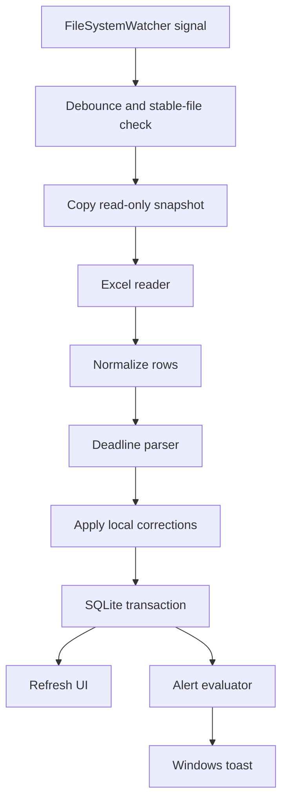

# Windows Task Tracker — Product & Technical Specification

> Tài liệu triển khai dành cho Codex/developer.  
> Trạng thái: Ready for implementation planning  
> Nền tảng đích: Windows 11 x64  
> Cập nhật: 2026-08-18

## 1. Mục đích tài liệu

Tài liệu này định nghĩa đầy đủ phạm vi sản phẩm, quy tắc nghiệp vụ, kiến trúc kỹ thuật, mô hình dữ liệu, hành vi UI, cơ chế theo dõi file Excel, thông báo Windows, kiểm thử và kế hoạch chia task để triển khai ứng dụng desktop theo dõi công văn/nhiệm vụ.

Mọi thay đổi nghiệp vụ sau này phải cập nhật tài liệu này trước hoặc kèm theo code tương ứng.

## 2. Bối cảnh

Người dùng có một file Excel `.xlsx` chứa nhiều sheet như:

- `THANG 7`
- `TUAN 30`
- `TUAN 31`
- `TUAN 32`
- `TUAN 33`

Các sheet có cấu trúc cột tương tự:

1. STT
2. Số công văn
3. Nội dung nhiệm vụ
4. Đơn vị thực hiện
5. Xử lý chính
6. Thời hạn
7. Tiến độ
8. Kết quả
9. Ghi chú

Ứng dụng phải đọc file, theo dõi thay đổi, xác định thời hạn, hiển thị trạng thái và phát thông báo khi nhiệm vụ sắp đến hạn hoặc quá hạn.

## 3. Các quyết định nghiệp vụ đã chốt

### 3.1. Nhiệm vụ trùng

- Mỗi dòng nguồn trong mỗi sheet là một bản ghi độc lập.
- Không gộp nhiệm vụ trùng giữa các sheet.
- Hai dòng có nội dung giống hệt nhưng nằm ở hai sheet khác nhau vẫn phải hiển thị thành hai dòng.
- Hai dòng giống nhau trong cùng một sheet cũng vẫn là hai dòng độc lập.
- STT không được dùng làm khóa vì dữ liệu thực tế có STT trùng và STT trống.

### 3.2. Thứ tự sheet tuần

- Sheet có tên `TUAN N` được coi là sheet tuần.
- Số tuần lớn hơn là mới hơn.
- Khi hiển thị mặc định, sheet tuần được sắp xếp giảm dần theo số tuần.
- Không cần suy luận lại thứ tự bằng ngày trong dữ liệu.
- Sheet không khớp mẫu `TUAN N` giữ thứ tự xuất hiện trong workbook và được xếp sau nhóm sheet tuần, trừ khi người dùng lọc riêng.

### 3.3. Khoảng ngày

- Ví dụ: `6/8-21/8/2026`.
- Parser phải lưu cả ngày bắt đầu và ngày kết thúc.
- Ngày dùng để cảnh báo là ngày bắt đầu: `6/8/2026`.
- UI vẫn phải hiển thị toàn bộ khoảng ngày gốc.

### 3.4. Ngày không có giờ

- Thời hạn được tính theo ngày lịch, không theo số giờ còn lại.
- `days_remaining = due_date - today` theo `DateOnly` tại múi giờ địa phương.
- `days_remaining = 1` nghĩa là còn một ngày lịch và phải cảnh báo.
- `days_remaining = 0` nghĩa là đến hạn hôm nay.
- `days_remaining < 0` nghĩa là đã quá hạn.
- Không tự gán 17:00 hoặc 23:59 cho mục đích hiển thị trạng thái ngày.

### 3.5. Hoàn thành

Một dòng chỉ được coi là hoàn thành khi giá trị cột `Kết quả`, sau khi:

1. chuẩn hóa Unicode về NFC; và
2. loại bỏ khoảng trắng đầu/cuối,

bằng chính xác chuỗi:

```text
Đã hoàn thành
```

Quy tắc so sánh phân biệt hoa/thường và không chấp nhận từ đồng nghĩa.

Các giá trị sau không được coi là hoàn thành:

- `Hoàn thành`
- `ĐÃ HOÀN THÀNH`
- `Đã xong`
- `Đã báo cáo`
- `Đã giao hàng`
- câu mô tả hoàn thành nằm ở cột Tiến độ

Khi hoàn thành:

- Không gửi cảnh báo mới.
- Hủy mọi lịch nhắc lại đang chờ.
- UI hiển thị trạng thái hoàn thành.

### 3.6. Chỉ đọc Excel

- Ứng dụng không ghi ngược vào Excel.
- Các sửa chữa ngày tháng hoặc xác nhận thủ công chỉ được lưu trong SQLite của ứng dụng.
- File Excel luôn là nguồn dữ liệu chỉ đọc.

### 3.7. Theo dõi file tự động

- Người dùng chọn file nguồn một lần ở lần chạy đầu hoặc trong Settings.
- Sau đó ứng dụng tự theo dõi file đó.
- Không yêu cầu import lại thủ công mỗi khi file thay đổi.
- Vẫn cung cấp nút `Đọc lại ngay` để xử lý khi cần.

### 3.8. Auto-start

- Ứng dụng tự khởi động cùng Windows.
- Chạy ở chế độ nền bằng tham số `--background`.
- Khi chạy nền, không tự bật cửa sổ chính; chỉ tạo tray icon, nạp dữ liệu và kiểm tra deadline.
- Người dùng có thể tắt/bật auto-start trong Settings.

### 3.9. Nhắc lại và xác nhận đã xem

- Cảnh báo sắp hạn bắt đầu khi còn đúng 1 ngày lịch.
- Dòng đang cần chú ý có checkbox `Đã xem` trong UI.
- Toast có action `Đã xem` nếu API hỗ trợ ổn định; action này có cùng hiệu lực với checkbox.
- Nếu chưa đánh dấu `Đã xem`, gửi lại sau 12 giờ.
- Chu kỳ nhắc lại mặc định là 12 giờ và được lưu dưới dạng setting để có thể cấu hình sau.
- Xác nhận được lưu theo `row_id + deadline_version + alert_level`.
- Khi ngày hạn thay đổi, xác nhận cũ không được tái sử dụng.
- `DueSoon` và `Overdue` là hai mức cảnh báo khác nhau:
  - Đánh dấu đã xem ở mức `DueSoon` dừng nhắc `DueSoon`.
  - Khi dòng chuyển sang `Overdue`, tạo một cảnh báo mới và checkbox của mức hiện tại trở về chưa xác nhận.
  - Đánh dấu đã xem ở mức `Overdue` dừng nhắc quá hạn cho deadline hiện tại.

### 3.10. Môi trường sử dụng

- Windows 11.
- Một máy, một người dùng Windows tại một thời điểm.
- Không đồng bộ nhiều máy.
- Không cần server.
- Không bị hạn chế bởi chính sách CNTT, SmartScreen hoặc yêu cầu ký số trong phạm vi MVP.

## 4. Mục tiêu sản phẩm

### 4.1. Mục tiêu

- Theo dõi tự động một file Excel xác định.
- Phản ánh từng dòng nguồn thành một dòng trên ứng dụng.
- Tính và hiển thị số ngày lịch còn lại.
- Cảnh báo trước một ngày và khi quá hạn.
- Tiếp tục cảnh báo khi cửa sổ bị ẩn xuống system tray.
- Không cảnh báo dòng đã hoàn thành.
- Không tự đoán các thời hạn không đủ thông tin.
- Cho phép người dùng xác nhận/sửa những ngày nghi vấn mà không thay đổi Excel.
- Giữ được trạng thái `Đã xem` qua các lần file Excel được lưu lại.

### 4.2. Ngoài phạm vi MVP

- Ghi dữ liệu ngược vào Excel.
- Tạo hoặc chỉnh sửa nhiệm vụ trong ứng dụng.
- Đồng bộ cloud hoặc nhiều máy.
- Nhiều tài khoản/người dùng/phân quyền.
- Push notification từ server.
- Ứng dụng mobile/web.
- Tự động suy ra lịch `Hằng tuần`.
- Tự suy ra deadline từ cột Tiến độ hoặc Nội dung.
- Gộp nhiệm vụ trùng.
- Hỗ trợ `.xls` cũ; MVP chỉ hỗ trợ `.xlsx`.

## 5. Dữ liệu thực tế đã quan sát

File mẫu hiện có:

- 5 sheet.
- Header ở dòng 3.
- 91 dòng nghiệp vụ.
- Có dòng phân nhóm như `ĐỘI KỸ THUẬT`, `ĐỘI PVMĐ` xen trong vùng dữ liệu.
- Có STT trùng, thiếu STT và dòng chỉ chứa STT.
- Có ngày text, ngày kèm giờ, khoảng ngày, thời hạn chung và số sê-ri Excel.
- Có 21 ô thời hạn dạng số Excel, gồm các giá trị như `46120`, `46181`, `46364`.
- Có dấu hiệu nhập ngày Việt Nam `dd/mm` nhưng Excel lưu theo `mm/dd`.

Không được commit file Excel thật lên repository công khai. Hãy tạo một fixture đã ẩn danh nhưng giữ nguyên kiểu ô, number format và các dạng deadline đặc biệt.

## 6. User stories

### US-01 — Chọn file nguồn

Là người dùng, tôi muốn chọn một file `.xlsx` để ứng dụng theo dõi file đó lâu dài.

Tiêu chí:

- Chỉ chấp nhận file `.xlsx` tồn tại và đọc được.
- Lưu đường dẫn trong Settings.
- Sau khi chọn, đọc file ngay.
- Khi đổi file nguồn, dữ liệu file cũ không xuất hiện trong danh sách hiện hành.

### US-02 — Tự cập nhật

Là người dùng, tôi muốn ứng dụng tự cập nhật sau khi tôi lưu file trong Excel.

Tiêu chí:

- Không yêu cầu bấm import.
- Không đọc file khi Excel đang ghi dang dở.
- Không refresh nhiều lần cho một lần Save.
- UI hiển thị thời điểm đọc thành công gần nhất và lỗi gần nhất nếu có.

### US-03 — Xem tất cả dòng

Là người dùng, tôi muốn mỗi dòng trong mọi sheet được hiển thị riêng, kể cả khi nội dung trùng.

Tiêu chí:

- Không merge giữa các sheet.
- Có cột Sheet và dòng nguồn.
- Có thể lọc theo sheet.

### US-04 — Xem trạng thái deadline

Là người dùng, tôi muốn thấy số ngày còn lại và mức độ khẩn cấp.

Tiêu chí:

- Còn 1 ngày: `Sắp đến hạn`.
- Hôm nay: `Đến hạn hôm nay`.
- Ngày đã qua: `Quá hạn`.
- Không xác định được ngày: `Cần rà soát`.
- Hoàn thành: `Đã hoàn thành` và không cảnh báo.

### US-05 — Xác nhận ngày nghi vấn

Là người dùng, tôi muốn chọn ngày đúng nếu Excel có thể đã đảo ngày/tháng.

Tiêu chí:

- Hiển thị ngày Excel đang lưu và ngày đảo đề xuất.
- Có lựa chọn giữ nguyên, dùng ngày đảo, nhập ngày khác hoặc chưa xác định.
- Không cảnh báo cho đến khi đã có ngày xác nhận.
- Không ghi thay đổi vào Excel.

### US-06 — Xác nhận đã xem

Là người dùng, tôi muốn đánh dấu đã xem để ứng dụng ngừng nhắc cùng một mức cảnh báo.

Tiêu chí:

- Checkbox có trong DataGrid hoặc detail panel.
- Trạng thái được lưu sau khi thoát app.
- Deadline đổi hoặc chuyển mức DueSoon → Overdue thì yêu cầu xác nhận mới.

### US-07 — Chạy nền

Là người dùng, tôi muốn đóng cửa sổ nhưng ứng dụng vẫn kiểm tra và thông báo.

Tiêu chí:

- Nút X mặc định ẩn cửa sổ xuống tray.
- Menu tray có `Mở`, `Đọc lại ngay`, `Tạm dừng thông báo`, `Thoát hẳn`.
- Chỉ `Thoát hẳn` mới kết thúc process.

## 7. Kiến trúc đề xuất

### 7.1. Công nghệ

- .NET 10 LTS.
- WPF, target `net10.0-windows`.
- MVVM tối giản; không bắt buộc dùng framework MVVM ngoài.
- ClosedXML để đọc `.xlsx`.
- Microsoft.Data.Sqlite để lưu dữ liệu cục bộ.
- Microsoft.Windows.AppNotifications cho local Windows toast.
- `System.Windows.Forms.NotifyIcon` cho system tray.
- `Microsoft.Extensions.Hosting` cho DI, logging và background services nếu không làm tăng độ phức tạp đáng kể.
- xUnit cho unit/integration tests.
- Inno Setup hoặc WiX cho `Setup.exe`; chọn một và ghi ADR trước khi triển khai installer.

Tài liệu tham khảo:

- [.NET support policy](https://dotnet.microsoft.com/en-us/platform/support/policy/dotnet-core)
- [WPF overview](https://learn.microsoft.com/en-us/dotnet/desktop/wpf/overview/)
- [Build Windows apps from non-Windows with EnableWindowsTargeting](https://learn.microsoft.com/en-us/dotnet/core/project-sdk/msbuild-props#enablewindowstargeting)
- [Windows app notifications for .NET](https://learn.microsoft.com/en-us/windows/apps/develop/notifications/app-notifications/app-notifications-dotnet)
- [NotifyIcon](https://learn.microsoft.com/en-us/dotnet/desktop/winforms/controls/notifyicon-component-windows-forms)
- [ClosedXML](https://docs.closedxml.io/en/latest/)
- [Microsoft.Data.Sqlite](https://learn.microsoft.com/en-us/dotnet/standard/data/sqlite/)
- [.NET single-file deployment](https://learn.microsoft.com/en-us/dotnet/core/deploying/single-file/overview)

### 7.2. Solution structure

```text
TaskTracker.sln
├── src/
│   ├── TaskTracker.Domain/
│   │   ├── TaskRow.cs
│   │   ├── DeadlineSpec.cs
│   │   ├── DeadlineResolution.cs
│   │   ├── AlertLevel.cs
│   │   └── TaskStatusCalculator.cs
│   ├── TaskTracker.Application/
│   │   ├── ImportWorkbookUseCase.cs
│   │   ├── RefreshSourceFileUseCase.cs
│   │   ├── EvaluateAlertsUseCase.cs
│   │   └── Ports/
│   ├── TaskTracker.Presentation/
│   │   └── TaskListPresentation.cs
│   ├── TaskTracker.Infrastructure/
│   │   ├── Excel/
│   │   ├── Persistence/
│   │   ├── FileWatching/
│   │   └── Logging/
│   └── TaskTracker.Windows/
│       ├── App.xaml
│       ├── Views/
│       ├── ViewModels/
│       ├── Notifications/
│       ├── Tray/
│       └── Startup/
├── tests/
│   ├── TaskTracker.Domain.Tests/
│   ├── TaskTracker.Application.Tests/
│   ├── TaskTracker.Infrastructure.Tests/
│   └── TaskTracker.Windows.Tests/
├── tests/fixtures/
│   └── sample-anonymized.xlsx
├── installer/
├── .github/workflows/
├── Directory.Build.props
└── README.md
```

### 7.3. Ranh giới nền tảng

`Domain`, `Application`, `Presentation` và phần lớn `Infrastructure` không được tham chiếu WPF hoặc Windows APIs.

Chỉ project `TaskTracker.Windows` được phép chứa:

- WPF/XAML.
- AppNotificationManager.
- NotifyIcon.
- Windows Registry auto-start.
- xử lý activation từ toast.

Mục đích của ranh giới này:

- Parser và logic deadline test được trên Linux.
- Hạn chế số phần bắt buộc test thủ công trên Windows.
- Giảm rủi ro Codex tạo business logic trong code-behind.

### 7.4. Luồng dữ liệu



## 8. Đọc workbook

### 8.1. Xác định sheet hợp lệ

Một sheet được đọc nếu tìm thấy một dòng header trong 20 dòng đầu, có tối thiểu các cột bắt buộc:

- Số công văn
- Nội dung nhiệm vụ
- Thời hạn
- Kết quả

Các tên header được chuẩn hóa bằng:

- Unicode NFC.
- Trim.
- Gom nhiều khoảng trắng thành một.
- So sánh không phân biệt hoa/thường cho mục đích nhận diện header.

Các sheet không hợp lệ được ghi warning, không làm hỏng toàn bộ lần refresh.

### 8.2. Xác định dòng nghiệp vụ

- Bắt đầu sau dòng header.
- Một dòng được coi là nghiệp vụ nếu có `Số công văn` hoặc `Nội dung nhiệm vụ`.
- Dòng chỉ có STT hoặc chỉ có nhãn nhóm ở cột đầu bị bỏ qua.
- Không dừng ở dòng trống đầu tiên vì dữ liệu có thể có khoảng trống xen kẽ.
- Dừng ở used range thực tế của sheet.
- Giữ `sheet_name`, `sheet_index`, `source_row_number`, `cell_address` của cột thời hạn.

### 8.3. Kiểu dữ liệu cần giữ

Đối với cột Thời hạn, phải giữ:

- `raw_text` hoặc `raw_number`.
- `cell_data_type`.
- `number_format_id` và `number_format_code` nếu có.
- giá trị hiển thị theo Excel nếu lấy được.
- địa chỉ ô.
- workbook date system 1900/1904.

Không được chỉ đọc chuỗi đã format vì sẽ mất bằng chứng để phát hiện ngày đảo.

## 9. Định danh dòng qua các lần refresh

Mục tiêu là giữ correction và checkbox `Đã xem` dù người dùng chèn thêm dòng trong Excel.

### 9.1. Row identity

Không sử dụng số dòng hoặc STT làm ID duy nhất.

Tạo `logical_row_key` từ:

```text
source_file_id
+ normalized_sheet_name
+ normalized_document_number
+ normalized_task_content
+ normalized_primary_handler
+ occurrence_ordinal_within_sheet
```

Quy tắc:

- `normalized_document_number` giữ phần mã công văn nhưng bỏ đoạn ngày ban hành cuối chuỗi nếu parse được.
- `normalized_task_content` chỉ chuẩn hóa Unicode/khoảng trắng; không fuzzy matching.
- `occurrence_ordinal_within_sheet` phân biệt các dòng giống hệt nhau trong cùng sheet.
- Không dùng deadline, tiến độ, kết quả hoặc số dòng trong key vì chúng có thể thay đổi.
- Không dùng key để gộp giữa sheet; sheet luôn là một phần của key.

### 9.2. Deadline version

`deadline_version` là hash của:

- loại deadline đã resolve;
- ngày bắt đầu;
- ngày kết thúc;
- giờ nếu có;
- quyết định correction hiện hành.

Khi deadline version thay đổi:

- Reset xác nhận `Đã xem`.
- Cho phép phát cảnh báo mới.
- Giữ lịch sử notification cũ để audit.

## 10. Deadline parser

### 10.1. Kiểu kết quả

```text
ExactDate
ExactDateTime
DateRange
ExcelDateConfirmed
ExcelDateAmbiguous
MonthOnly
WeekOnly
RecurringUnconfigured
MissingYear
Blank
Unrecognized
Invalid
```

Mỗi kết quả gồm:

- `kind`.
- `raw_value`.
- `start_date` nullable.
- `end_date` nullable.
- `time_of_day` nullable.
- `alert_date` nullable.
- `requires_review`.
- `diagnostic_code`.
- danh sách ứng viên nếu mơ hồ.

### 10.2. Chuẩn hóa text

Trước khi parse:

- Unicode NFC.
- Trim.
- Gom khoảng trắng.
- Chuẩn hóa `H` thành `h` cho parser.
- Chấp nhận `16h00`, `16h`, `16:00`.
- Chuẩn hóa `–`/`—` thành `-`.
- Không bỏ từ có ý nghĩa như `Trong tháng`, `Hằng tuần`.

### 10.3. Parser theo thứ tự

1. Blank.
2. Excel numeric/date cell.
3. Khoảng ngày đầy đủ.
4. Ngày kèm giờ đầy đủ.
5. Ngày đầy đủ.
6. Ngày có giờ nhưng thiếu năm.
7. `Trong tháng`.
8. `Trong tuần`.
9. `Hằng tuần`.
10. Unrecognized.

Không dùng parser tự do trên văn bản không khớp pattern đã biết.

### 10.4. Pattern phải hỗ trợ

#### Ngày đầy đủ

```text
29/7/2026
29/07/2026
29-7-2026
```

#### Ngày kèm giờ

```text
16h00 ngày 29/7/2026
16H00 NGÀY 05/8/2026
14:00 ngày 7/8/2026
```

#### Khoảng ngày

```text
6/8-21/8/2026
06/08 - 21/08/2026
```

Đối với khoảng cùng năm:

- Gán năm cuối cho cả hai đầu.
- `alert_date = start_date`.

Đối với khoảng có dấu hiệu qua năm, ví dụ `28/12-5/1/2027`, không tự suy luận năm bắt đầu; đưa vào review.

#### Không đủ thông tin

```text
Trong tháng 7/2026
Trong tuần 29
Hằng tuần
14h00 ngày 7/8
```

Các trường hợp này không được cảnh báo tự động cho đến khi người dùng cung cấp ngày cụ thể. Riêng `Hằng tuần` có thể được hỗ trợ bằng recurrence rule ở phiên bản sau.

### 10.5. Ngày Excel bị đảo

Khi ô là numeric/date:

1. Chuyển giá trị Excel sang ngày theo date system của workbook.
2. Nếu ngày và tháng đều từ 1 đến 12, tạo ứng viên đảo ngày/tháng.
3. Đánh giá dấu hiệu nghi vấn, nhưng không tự sửa.

Dấu hiệu nghi vấn:

- Ngày Excel nằm trước ngày ban hành trong `Số công văn`.
- Ngày Excel lệch nhiều tháng so với sheet tuần.
- Ứng viên đảo nằm gần kỳ của sheet.
- Cùng raw serial xuất hiện ở nhiều sheet với ngữ cảnh tương tự.

Kết quả phải là `ExcelDateAmbiguous` cho đến khi người dùng xác nhận.

Màn hình review cung cấp:

- Giữ ngày Excel.
- Dùng ngày đảo.
- Nhập ngày khác.
- Chưa xác định.

Correction được lưu cục bộ theo `logical_row_key + raw_deadline_fingerprint`.

Nếu raw deadline đổi, correction cũ không được áp dụng.

## 11. Tính trạng thái

### 11.1. Thứ tự ưu tiên

```text
Completed
NeedsReview
Overdue
DueToday
DueSoon
Normal
```

Quy tắc:

1. Nếu Kết quả là `Đã hoàn thành` → `Completed`.
2. Nếu không có `alert_date` chắc chắn → `NeedsReview`.
3. Nếu `alert_date < today` → `Overdue`.
4. Nếu `alert_date == today` → `DueToday`.
5. Nếu `alert_date == today + 1 day` → `DueSoon`.
6. Còn lại → `Normal`.

`today` lấy từ clock abstraction để test được, sử dụng local date trên Windows.

### 11.2. Múi giờ

- MVP sử dụng `TimeZoneInfo.Local` của máy Windows.
- Log phải ghi offset tại thời điểm đánh giá.
- Không hardcode UTC+7 trong domain logic.

## 12. Notification engine

### 12.1. Thời điểm kiểm tra

- Ngay khi app khởi động.
- Sau mỗi lần refresh file thành công.
- Sau khi người dùng sửa deadline/correction.
- Khi máy resume từ sleep.
- Timer định kỳ mỗi 15 phút.

Timer không quyết định số ngày; số ngày luôn dựa trên `DateOnly`.

### 12.2. Alert levels

```text
DueSoon
DueToday
Overdue
```

Để tránh quá nhiều mức xác nhận, `DueSoon` và `DueToday` có thể dùng chung acknowledgment group `Upcoming`, nhưng `Overdue` phải là group mới.

Quyết định MVP:

- `DueSoon` và `DueToday` dùng chung `Upcoming`.
- `Overdue` dùng `Overdue`.

### 12.3. Lịch nhắc

Khi lần đầu vào một alert group:

- Gửi toast ngay.
- Ghi `first_notified_at`, `last_notified_at`.

Nếu chưa acknowledged:

- Đủ 12 giờ kể từ `last_notified_at` thì gửi lại.
- Không gửi sớm hơn do app restart.

Nếu acknowledged:

- Không gửi lại group đó cho deadline version hiện tại.

Nếu hoàn thành:

- Không gửi.

Nếu deadline không chắc chắn:

- Không gửi.

### 12.4. Gộp toast

Để tránh spam:

- 1–3 dòng cần cảnh báo: có thể gửi toast riêng.
- Trên 3 dòng cùng lúc: gửi một toast tổng hợp, ví dụ `Có 7 nhiệm vụ cần chú ý`.
- Click toast tổng hợp mở app với filter tương ứng.
- Dù toast được gộp, notification state vẫn được ghi cho từng dòng.

### 12.5. Nội dung toast

Toast riêng:

```text
Sắp đến hạn — còn 1 ngày
[Số công văn]
[Nội dung rút gọn]
Sheet: TUAN 33
```

Actions:

- `Mở`.
- `Đã xem`.

Toast quá hạn:

```text
Đã quá hạn 2 ngày
[Số công văn]
[Nội dung rút gọn]
```

Không hiển thị toàn bộ nội dung dài trên toast.

## 13. File monitoring

### 13.1. Không đọc trực tiếp ngay khi nhận event

`FileSystemWatcher` chỉ là tín hiệu. Excel có thể phát nhiều event hoặc thay file bằng rename.

Luồng xử lý:

1. Theo dõi thư mục cha của file.
2. Nhận `Changed`, `Created`, `Renamed`, `Deleted` liên quan đúng tên file.
3. Debounce 2 giây.
4. Kiểm tra file tồn tại.
5. Lấy size và `LastWriteTimeUtc` hai lần cách nhau 500 ms.
6. Nếu chưa ổn định, retry với backoff.
7. Copy bytes sang file tạm bằng chế độ chia sẻ đọc phù hợp.
8. Xác minh file tạm là ZIP/XLSX hợp lệ.
9. Tính SHA-256.
10. Nếu hash giống snapshot gần nhất, bỏ qua.
11. Parse file tạm.
12. Commit dữ liệu trong một SQLite transaction.

### 13.2. Retry policy

- Tối đa 6 lần.
- Backoff đề xuất: 1s, 2s, 4s, 8s, 15s, 30s.
- Thất bại không xóa dữ liệu đang hiển thị.
- UI/tray hiển thị cảnh báo `Không thể đọc bản cập nhật mới; đang dùng dữ liệu lần đọc trước`.
- Nút `Đọc lại ngay` cho phép retry thủ công.

### 13.3. Xóa hoặc di chuyển file

- Giữ snapshot gần nhất.
- Đánh dấu source status `Missing`.
- Không tạo cảnh báo deadline mới dựa trên refresh thất bại, nhưng timer có thể tiếp tục cảnh báo từ snapshot gần nhất.
- Tray icon hiển thị trạng thái lỗi.

## 14. SQLite

### 14.1. Vị trí

```text
%LocalAppData%\TaskTracker\tasktracker.db
```

Logs:

```text
%LocalAppData%\TaskTracker\logs\
```

### 14.2. Bảng đề xuất

#### settings

```text
key TEXT PRIMARY KEY
value TEXT NOT NULL
updated_at_utc TEXT NOT NULL
```

#### source_files

```text
id TEXT PRIMARY KEY
path TEXT NOT NULL UNIQUE
enabled INTEGER NOT NULL
last_successful_hash TEXT NULL
last_successful_read_utc TEXT NULL
last_error TEXT NULL
last_error_utc TEXT NULL
```

#### import_snapshots

```text
id TEXT PRIMARY KEY
source_file_id TEXT NOT NULL
file_hash TEXT NOT NULL
file_modified_utc TEXT NULL
imported_at_utc TEXT NOT NULL
status TEXT NOT NULL
diagnostics_json TEXT NULL
```

#### task_rows

```text
id TEXT PRIMARY KEY
source_file_id TEXT NOT NULL
logical_row_key TEXT NOT NULL
sheet_name TEXT NOT NULL
sheet_week_number INTEGER NULL
source_row_number INTEGER NOT NULL
stt TEXT NULL
document_number TEXT NULL
task_content TEXT NULL
executing_unit TEXT NULL
primary_handler TEXT NULL
deadline_raw TEXT NULL
progress TEXT NULL
result TEXT NULL
note TEXT NULL
is_completed INTEGER NOT NULL
deadline_version TEXT NULL
current_status TEXT NOT NULL
days_remaining INTEGER NULL
snapshot_id TEXT NOT NULL
is_current INTEGER NOT NULL
UNIQUE(source_file_id, logical_row_key, snapshot_id)
```

#### deadline_resolutions

```text
id TEXT PRIMARY KEY
logical_row_key TEXT NOT NULL
raw_deadline_fingerprint TEXT NOT NULL
parser_kind TEXT NOT NULL
raw_value TEXT NULL
excel_candidate TEXT NULL
swapped_candidate TEXT NULL
selected_start_date TEXT NULL
selected_end_date TEXT NULL
selected_time TEXT NULL
resolution_source TEXT NOT NULL
requires_review INTEGER NOT NULL
updated_at_utc TEXT NOT NULL
UNIQUE(logical_row_key, raw_deadline_fingerprint)
```

`resolution_source`:

```text
Parser
KeepExcelDate
UseSwappedDate
ManualDate
UnresolvedByUser
```

#### notification_states

```text
id TEXT PRIMARY KEY
logical_row_key TEXT NOT NULL
deadline_version TEXT NOT NULL
alert_group TEXT NOT NULL
first_notified_at_utc TEXT NULL
last_notified_at_utc TEXT NULL
acknowledged_at_utc TEXT NULL
notification_count INTEGER NOT NULL DEFAULT 0
UNIQUE(logical_row_key, deadline_version, alert_group)
```

### 14.3. Migration

- Schema version lưu trong bảng `schema_info` hoặc dùng `PRAGMA user_version`.
- Migration chạy trước khi khởi động background services.
- Migration phải idempotent và có integration test.
- Không dùng `EnsureCreated` như chiến lược lâu dài.

## 15. UI/UX

### 15.1. Main window

Header:

- Tên file nguồn.
- Trạng thái theo dõi.
- Lần đọc thành công gần nhất.
- Nút `Đọc lại ngay`.
- Nút `Chọn file khác`.
- Nút Settings.

Summary cards:

- Quá hạn.
- Đến hạn hôm nay.
- Còn 1 ngày.
- Bình thường.
- Đã hoàn thành.
- Cần rà soát.

Filter:

- Sheet.
- Đơn vị thực hiện.
- Xử lý chính.
- Trạng thái.
- Chỉ hiện chưa xem.
- Tìm kiếm công văn/nội dung.
- Mỗi combobox có lựa chọn `Tất cả`.
- Nút `Xóa bộ lọc` xóa đồng thời tìm kiếm, ba combobox và `Chỉ hiện chưa xem`.

### 15.2. DataGrid

Cột mặc định:

1. Đã xem.
2. Số công văn.
3. Nội dung nhiệm vụ.
4. Xử lý chính.
5. Thời hạn đã resolve, định dạng `dd/MM/yyyy`.
6. Còn lại.

Trạng thái, Sheet, STT, kết quả, thời hạn gốc, nguồn correction và dòng/ô nguồn được hiển thị trong detail panel thay vì chiếm cột mặc định.

Sorting mặc định:

1. Mức độ: Overdue → DueToday → DueSoon → NeedsReview → Normal → Completed.
2. Sheet tuần giảm dần.
3. Dòng nguồn tăng dần.

Màu:

- Overdue: nền đỏ nhạt, icon đỏ, label chữ.
- DueToday: cam đậm.
- DueSoon: vàng/cam.
- NeedsReview: tím/xanh tím.
- Normal: trung tính.
- Completed: xanh lá hoặc xám, chữ mờ.

Không được chỉ dùng màu; mỗi trạng thái phải có text/icon.

### 15.3. Detail panel

Hiển thị:

- Toàn bộ nội dung.
- Dữ liệu nguồn.
- Sheet và địa chỉ ô.
- Kiểu dữ liệu Excel.
- Deadline parser result.
- Correction đang áp dụng.
- Trạng thái và nguồn correction bằng nhãn tiếng Việt.
- Lịch sử notification/acknowledgment.

Actions:

- `Đã xem`.
- `Sửa ngày đã xác nhận`.
- `Xóa sửa chữa cục bộ` để parse lại.

### 15.4. Review screen

Tab/filter:

- Ngày Excel nghi bị đảo.
- Thiếu năm.
- Trong tháng/tuần.
- Hằng tuần.
- Không nhận dạng.

Mỗi item hiển thị:

- Sheet/dòng/ô.
- Số công văn và nội dung.
- Giá trị gốc.
- Các ứng viên.
- Lý do nghi vấn.

Actions:

- `Giữ ngày Excel` chỉ bật khi có ứng viên ngày Excel hợp lệ.
- `Đảo ngày/tháng` chỉ bật khi có ứng viên ngày đảo hợp lệ.
- `Nhập ngày` nhận đúng định dạng `dd/MM/yyyy`.
- `Chưa xác định` giữ item ở trạng thái cần rà soát và không phát cảnh báo.

Màn hình phải nói rõ Excel chỉ được đọc. Mọi lựa chọn được lưu trong SQLite cục bộ theo `logical_row_key + raw_deadline_fingerprint`; nếu giá trị thời hạn gốc đổi thì correction cũ ngừng áp dụng.

## 16. Tray và application lifecycle

### 16.1. Close behavior

- Nút X: hide main window.
- App tiếp tục chạy.
- Lần đầu người dùng bấm X, hiển thị balloon/toast ngắn: `Ứng dụng vẫn đang chạy ở khay hệ thống`.
- Có setting `Không hiện lại thông báo này`.

### 16.2. Tray menu

- `Mở Task Tracker`.
- `Đọc lại file ngay`.
- `Tạm dừng thông báo`/`Tiếp tục thông báo`.
- `Mở danh sách cần rà soát`.
- `Thoát hẳn`.

### 16.3. Single instance

- Dùng named mutex theo user session.
- Nếu mở instance thứ hai:
  - Gửi activation cho instance hiện tại.
  - Mở/foreground main window.
  - Instance thứ hai thoát.

### 16.4. Auto-start

MVP dùng per-user registry:

```text
HKCU\Software\Microsoft\Windows\CurrentVersion\Run
```

Command:

```text
"<installed-path>\TaskTracker.exe" --background
```

Yêu cầu:

- Không cần admin.
- Installer tạo setting mặc định bật.
- App kiểm tra/sửa entry khi người dùng đổi setting.
- Uninstaller xóa entry.
- Không chạy app elevated vì Windows app notifications không hỗ trợ elevated app.

## 17. Logging và chẩn đoán

Log các sự kiện:

- App start/exit.
- Source file changed signal.
- Debounce/retry.
- Snapshot hash.
- Sheet/header discovery.
- Số dòng đọc được và số lỗi parse theo loại.
- DB migration.
- Alert evaluation summary.
- Toast send/activation.
- Auto-start registration.

Không log toàn bộ nội dung công văn ở mức Information. Có thể log row key và sheet/dòng. Nội dung chi tiết chỉ ở Debug và phải có giới hạn.

Log rotation:

- Tối đa 7 file.
- Mỗi file tối đa 5 MB.

## 18. Bảo mật và riêng tư

- Dữ liệu ở local machine.
- Không gửi network.
- Không telemetry trong MVP.
- Không commit file Excel thật hoặc database thật.
- File tạm phải được xóa best-effort sau parse.
- Không mở macro hoặc thực thi nội dung workbook.
- Chỉ hỗ trợ `.xlsx`; file là ZIP được đọc như dữ liệu.

## 19. Phát triển trên Linux và kiểm thử Windows

### 19.1. Có thể làm gì trên Linux

- Thiết kế solution và code C#.
- Domain model.
- Deadline parser.
- Status calculator.
- Row identity.
- Notification scheduling logic với fake clock/notifier.
- SQLite repositories/migrations.
- Excel reader với fixture `.xlsx`.
- File watcher orchestration tests bằng abstraction/fake events.
- ViewModels nếu không tham chiếu WPF trực tiếp.
- Unit/integration tests cho core.
- Cross-build project Windows bằng:

```xml
<EnableWindowsTargeting>true</EnableWindowsTargeting>
```

Microsoft cho phép build Windows Forms/WPF trên non-Windows bằng thuộc tính này, nhưng khuyến nghị release build trên Windows vì output cross-build có thể khác và executable có thể thiếu Windows subsystem/icon đúng cách.

### 19.2. Không thể xác nhận đầy đủ trên Linux

- Chạy WPF UI.
- Render/kiểm tra XAML thực tế.
- System tray.
- Windows toast và activation button.
- Auto-start registry.
- Named mutex/foreground behavior đầy đủ.
- Resume-from-sleep behavior.
- Installer và uninstall.
- Chạy thực tế trên Windows 11.

### 19.3. CI đề xuất

Job 1 — Linux core:

```text
runs-on: ubuntu-latest
- restore
- build Domain/Application/Infrastructure
- run cross-platform tests
```

Job 2 — Windows build:

```text
runs-on: windows-latest
- restore
- build full solution
- run all automated tests
- publish win-x64 self-contained
- build Setup.exe on release tag
- upload artifacts
```

GitHub cung cấp hosted runners cho cả Linux và Windows. Tuy nhiên runner CI không thay thế smoke test trên desktop Windows 11 tương tác, đặc biệt với toast, tray và startup. Xem [GitHub-hosted runners](https://docs.github.com/en/actions/reference/runners/github-hosted-runners).

### 19.4. Workflow làm việc khuyến nghị

1. Code và test core trên Linux.
2. Push branch lên GitHub.
3. Windows CI phải xanh trước merge.
4. Sau mỗi milestone có Windows integration, chạy smoke test trên máy Windows 11 thật.
5. Release candidate chỉ được build từ Windows runner hoặc máy Windows sạch.
6. Cài `Setup.exe` trên Windows 11 sạch để nghiệm thu.

## 20. Chiến lược kiểm thử

### 20.1. Unit tests bắt buộc

Deadline parser:

- Leap year và ngày không hợp lệ.
- `29/7/2026`.
- `16h00 ngày 29/7/2026`.
- `16H00 NGÀY 05/8/2026`.
- `6/8-21/8/2026`, alert theo 6/8.
- `Trong tháng 7/2026`.
- `Trong tuần 29`.
- `Hằng tuần`.
- `14h00 ngày 7/8`.
- Blank.
- Text dài chứa một ngày nhưng không phải pattern deadline hợp lệ.

Completion:

- `Đã hoàn thành` → true.
- Có khoảng trắng ngoài → true sau Trim.
- Case khác → false.
- Từ đồng nghĩa → false.
- Tiến độ có chữ hoàn thành nhưng Kết quả trống → false.

Status:

- D−2 Normal.
- D−1 DueSoon.
- D0 DueToday.
- D+1 Overdue.
- Completed thắng mọi trạng thái.
- NeedsReview không phát alert.

Notification:

- Gửi lần đầu.
- Không gửi lại trước 12h.
- Gửi lại sau 12h nếu chưa ack.
- Không gửi sau ack.
- Chuyển Upcoming → Overdue tạo alert mới.
- Deadline version đổi reset ack.
- App restart không làm gửi trùng.

### 20.2. Integration tests

- Đọc fixture nhiều sheet.
- Header không ở dòng 1.
- Dòng nhóm bị bỏ qua.
- STT trùng/trống vẫn tạo row riêng.
- Dòng trùng giữa sheet không bị merge.
- Excel numeric date tạo ambiguity.
- Transaction refresh không để DB ở trạng thái nửa chừng.
- Row identity tồn tại khi dòng Excel bị dịch xuống.
- Correction được áp dụng lại khi raw deadline không đổi.
- Correction bị vô hiệu khi raw deadline đổi.
- File hash giống nhau không tạo snapshot mới.

### 20.3. Windows manual smoke tests

1. Cài Setup.exe trên Windows 11.
2. Chọn file nguồn.
3. Mở Excel, sửa một dòng, Save; app tự refresh.
4. Thu nhỏ/đóng cửa sổ; tray vẫn tồn tại.
5. Dùng test clock hoặc fixture tạo deadline ngày mai; toast xuất hiện.
6. Không tick Đã xem; xác minh nhắc lại bằng cấu hình test rút ngắn.
7. Tick Đã xem; xác minh không nhắc lại.
8. Chuyển task sang quá hạn; xác minh alert mới.
9. Đổi Kết quả thành `Đã hoàn thành`; Save; không còn alert.
10. Restart Windows; app tự chạy nền.
11. Click toast `Mở`; đúng row được focus.
12. Click toast `Đã xem`; trạng thái được lưu.
13. Uninstall; auto-start entry và file chương trình bị xóa.

## 21. Kế hoạch chia task cho Codex

Mỗi task nên là một PR/commit logic độc lập. Không giao một prompt kiểu “xây toàn bộ app” vì khó review và dễ trộn business logic vào UI.

### Milestone 0 — Repository foundation

#### TASK-00: Scaffold solution

Phạm vi:

- Tạo solution/projects đúng cấu trúc.
- Thêm `Directory.Build.props`.
- Bật nullable, warnings, analyzers cơ bản.
- Thiết lập `EnableWindowsTargeting` cho workflow Linux.
- Thêm test projects.
- README hướng dẫn build Linux/Windows.

Hoàn thành khi:

- Core build/test trên Linux.
- Full solution build trên Windows CI.
- Không có business logic.

#### TASK-01: CI baseline

Phạm vi:

- GitHub Actions Linux core job.
- Windows full-build job.
- Cache NuGet.
- Upload test results khi fail.

Hoàn thành khi:

- Push/PR chạy cả hai job.
- Branch protection có thể yêu cầu hai job.

### Milestone 1 — Domain core

#### TASK-02: Domain models and clock

Phạm vi:

- `DeadlineSpec` hierarchy.
- `TaskRow`.
- `TaskStatus`/`AlertLevel`.
- `IClock` và fake clock cho tests.

Hoàn thành khi:

- Không phụ thuộc Windows/SQLite/ClosedXML.
- Unit tests cho model invariants.

#### TASK-03: Deadline text parser

Phạm vi:

- Text normalization.
- Exact date/date-time/range parsers.
- Unresolved categories.
- Diagnostic codes.

Hoàn thành khi:

- Tất cả test cases ở mục 20.1 xanh.
- Không dùng general-purpose `DateTime.Parse` cho input mơ hồ.

#### TASK-04: Excel date ambiguity detector

Phạm vi:

- Convert Excel numeric date theo date system.
- Tạo swapped candidate.
- Context diagnostics.
- Không auto-correct.

Hoàn thành khi:

- Test được serial tương ứng với các ví dụ 04/08 và 12/08.
- Ambiguous result không có alert date trước confirmation.

#### TASK-05: Completion and status calculator

Phạm vi:

- Exact completion rule.
- DateOnly-based days remaining.
- Status precedence.

Hoàn thành khi:

- Test matrix hoàn chỉnh.

### Milestone 2 — Excel ingestion and persistence

#### TASK-06: Excel reader

Phạm vi:

- ClosedXML adapter.
- Header detection.
- Sheet/week parsing.
- Skip group/empty rows.
- Preserve cell metadata.
- Anonymized fixture.

Hoàn thành khi:

- Fixture đọc đúng số row dự kiến.
- Dòng trùng vẫn riêng biệt.
- Không dùng STT làm ID.

#### TASK-07: Row identity and refresh diff

Phạm vi:

- `logical_row_key`.
- Occurrence ordinal.
- Deadline fingerprint/version.
- Match current snapshot với previous state.

Hoàn thành khi:

- Chèn row không làm mất ack/correction của các row không đổi.
- Hai duplicate trong cùng sheet không bị collapse.

#### TASK-08: SQLite schema and migrations

Phạm vi:

- Database initialization.
- Migrations.
- Repositories.
- Transactional snapshot commit.

Hoàn thành khi:

- Integration tests CRUD/migration/rollback xanh.
- DB nằm trong LocalAppData trên Windows; test dùng temp path.

#### TASK-09: Import/refresh use case

Phạm vi:

- Orchestrate snapshot → parse → correction → DB.
- Preserve last good snapshot on failure.
- Return diagnostics summary.

Hoàn thành khi:

- Không phụ thuộc WPF.
- Test refresh success/failure/hash-no-change.

### Milestone 3 — Automatic file monitoring

#### TASK-10: Stable-file reader

Phạm vi:

- Stable size/mtime check.
- Retry/backoff.
- Copy to temp.
- SHA-256 and XLSX validation.

Hoàn thành khi:

- Tests bằng fake filesystem abstraction hoặc controlled temp files.
- Không parse file đang ghi dở.

#### TASK-11: File watcher service

Phạm vi:

- FileSystemWatcher wrapper.
- Debounce.
- Handle Changed/Created/Renamed/Deleted.
- Manual refresh command.

Hoàn thành khi:

- Một chuỗi event Save chỉ tạo một refresh.
- Watcher có thể restart khi đổi source path.

### Milestone 4 — Alert engine

#### TASK-12: Notification state and scheduler

Phạm vi:

- Upcoming/Overdue groups.
- 12h repeat.
- Acknowledgment.
- Deadline version reset.
- Notification batching decision.

Hoàn thành khi:

- Test bằng fake clock và fake notifier.
- Không tham chiếu Windows notification APIs.

#### TASK-13: Windows notification adapter

Phạm vi:

- AppNotificationManager registration.
- Send individual/summary toast.
- Handle `Mở` và `Đã xem`.
- Activation routing.

Hoàn thành khi:

- Build/test trên Windows.
- Manual toast smoke test pass.

### Milestone 5 — WPF application

#### TASK-14: WPF shell and ViewModels

Phạm vi:

- App startup/DI.
- Main window shell.
- Source status header.
- Summary cards.
- Async load/error states.

Hoàn thành khi:

- Không block UI thread khi đọc Excel/DB.
- ViewModels có unit tests nơi phù hợp.

#### TASK-15: Task DataGrid and filters

Phạm vi:

- Columns/sorting/filter/search.
- Color/icon/status labels.
- Checkbox Đã xem.
- Detail panel.

Hoàn thành khi:

- Mỗi source row hiển thị riêng.
- Filter/sort đúng spec.
- Accessibility không phụ thuộc màu.

#### TASK-16: Deadline review UI

Phạm vi:

- Review categories.
- Candidate comparison.
- Keep/swap/manual/unresolved actions.
- Reset correction.

Hoàn thành khi:

- Correction lưu SQLite và áp dụng ngay.
- Excel không bị sửa.

#### TASK-17: Tray and single-instance lifecycle

Phạm vi:

- NotifyIcon/context menu.
- Close-to-tray.
- Exit command.
- Named mutex/second-instance activation.
- Resume-from-sleep trigger.

Hoàn thành khi:

- Manual Windows smoke tests pass.

#### TASK-18: Settings and auto-start

Phạm vi:

- Source file picker.
- Notification pause.
- Repeat interval setting persisted, UI có thể chỉ hiển thị read-only 12h trong MVP.
- HKCU Run registration.
- `--background` startup.

Hoàn thành khi:

- Restart Windows mở app nền.
- Toggle off xóa registry entry.

### Milestone 6 — Distribution and release

#### TASK-19: Self-contained publish

Phạm vi:

- `win-x64` release profile.
- Self-contained publish.
- App icon/version metadata.
- Verify Windows subsystem; không bật console window.

Hoàn thành khi:

- Chạy trên Windows 11 không cài .NET runtime.

#### TASK-20: Setup.exe and uninstall

Phạm vi:

- Per-user installer.
- Start Menu shortcut.
- Upgrade handling.
- Uninstall cleanup.
- Không xóa DB mặc định khi upgrade.
- Khi uninstall, hỏi hoặc document cách giữ/xóa local data.

Hoàn thành khi:

- Clean install/upgrade/uninstall test pass.

#### TASK-21: End-to-end release QA

Phạm vi:

- Chạy checklist mục 20.3.
- Fix blocker bugs.
- Release notes.
- Tag version `v0.1.0`.

Hoàn thành khi:

- Không còn bug Severity 1/2.
- Setup artifact được tạo từ Windows CI.

## 22. Cách giao task cho Codex

Mỗi lần chỉ giao một task và kèm các ràng buộc sau:

```text
Implement TASK-XX from windows-task-tracker-spec.md.

Constraints:
- Stay within the task scope.
- Do not change confirmed business rules.
- Keep domain/application code Windows-independent unless this is explicitly a Windows integration task.
- Add or update tests for every behavior introduced.
- Do not commit the real Excel file; use anonymized fixtures.
- Run the relevant Linux/core tests and Windows-targeted build where available.
- Report changed files, tests run, and any spec ambiguity before expanding scope.
```

Với task Windows-specific, thêm:

```text
- A successful cross-build on Linux is not sufficient acceptance.
- Add a Windows CI check and provide a short Windows 11 manual smoke-test procedure.
```

Không nên cho Codex làm đồng thời UI, parser, persistence và notification trong cùng một task.

## 23. Definition of Done chung

Một task chỉ hoàn thành khi:

- Code đúng scope.
- Build không warning mới đáng kể.
- Unit/integration tests liên quan xanh.
- Không đưa Windows dependency vào core project sai ranh giới.
- Không sửa file Excel nguồn.
- Không làm mất migration/data cũ.
- Có logging cho failure path quan trọng.
- Tài liệu/README cập nhật nếu thay đổi cách build/run.
- Với Windows integration: có Windows CI hoặc manual smoke result tương ứng.

## 24. Acceptance criteria cho MVP

MVP được nghiệm thu khi đáp ứng đồng thời:

1. Cài được bằng Setup.exe trên Windows 11 không có .NET runtime cài riêng.
2. Chọn file `.xlsx` một lần và tự theo dõi sau đó.
3. Save file bằng Excel làm app refresh tự động.
4. Mỗi source row hiển thị riêng; không merge giữa sheet.
5. Sheet tuần mới hơn xuất hiện trước.
6. Các dạng ngày đã biết parse đúng.
7. Khoảng ngày cảnh báo theo ngày bắt đầu.
8. Ngày mơ hồ/không đủ thông tin không phát cảnh báo trước khi review.
9. `Đã hoàn thành` là điều kiện hoàn thành duy nhất.
10. Còn 1 ngày lịch phát toast.
11. Chưa ack thì nhắc lại sau 12 giờ.
12. Ack dừng nhắc cho alert group hiện tại.
13. Chuyển sang quá hạn tạo alert group mới.
14. Close window vẫn chạy tray và phát toast.
15. Restart Windows tự chạy app nền.
16. App không ghi thay đổi vào Excel.
17. State correction/ack tồn tại sau restart và refresh.
18. Installer/uninstaller hoạt động ổn định.

## 25. Các rủi ro còn lại

### R-01 — Row identity khi nội dung bị sửa mạnh

Nếu người dùng sửa đồng thời số công văn, nội dung và xử lý chính, app có thể coi đó là row mới và reset ack/correction. Đây là hành vi chấp nhận được trong MVP; log và UI nên cho thấy row mới.

### R-02 — Duplicate hoàn toàn trong cùng sheet

Occurrence ordinal có thể đổi nếu chèn một duplicate mới ở phía trên. MVP chấp nhận rủi ro nhỏ này. Nếu xảy ra thường xuyên, cần thêm cột ID ổn định vào nguồn Excel hoặc duy trì matching history phức tạp hơn.

### R-03 — Excel save events

FileSystemWatcher không bảo đảm một event cho một lần save. Debounce, stable-file check và hash bắt buộc phải có.

### R-04 — Notification bị tắt ở Windows Settings/Do Not Disturb

Ứng dụng không thể bảo đảm toast được nhìn thấy nếu Windows chặn notification. Settings cần có nút `Gửi thông báo thử` và chỉ dẫn mở Windows notification settings.

### R-05 — GitHub Windows runner không phải desktop Windows 11 tương tác

CI build được app nhưng không chứng minh tray/toast thực sự hiển thị. Release bắt buộc có smoke test trên máy Windows 11 thật.

### R-06 — App bị người dùng Exit

Auto-start chỉ giúp ở lần đăng nhập tiếp theo. Khi người dùng chọn `Thoát hẳn`, app không thể thông báo cho đến khi chạy lại. Tray menu phải diễn đạt rõ hành vi này.

## 26. Đề xuất thứ tự bắt đầu

Thứ tự tối ưu:

```text
TASK-00 → TASK-01
→ TASK-02 → TASK-03 → TASK-04 → TASK-05
→ TASK-06 → TASK-07 → TASK-08 → TASK-09
→ TASK-10 → TASK-11
→ TASK-12
→ TASK-14 → TASK-15 → TASK-16
→ TASK-13 → TASK-17 → TASK-18
→ TASK-19 → TASK-20 → TASK-21
```

Có thể bắt đầu code trên Linux ngay từ TASK-00 đến TASK-12 và phần lớn TASK-14/15 ViewModel. Cần Windows từ TASK-13 trở đi để nghiệm thu thực tế, dù toàn bộ repository vẫn có thể được push và build tự động bằng GitHub Actions.
